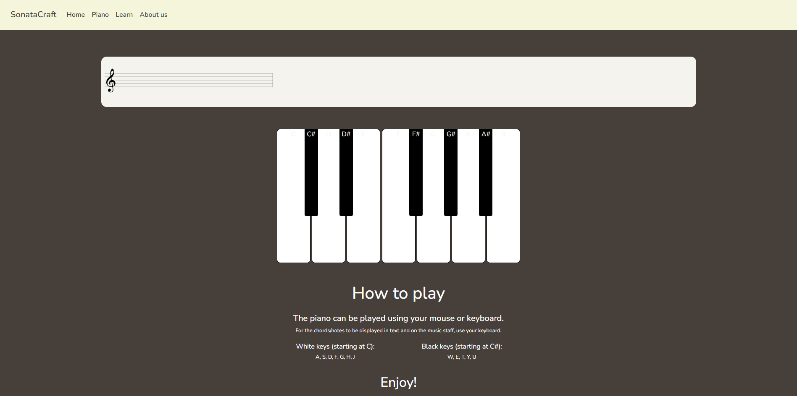
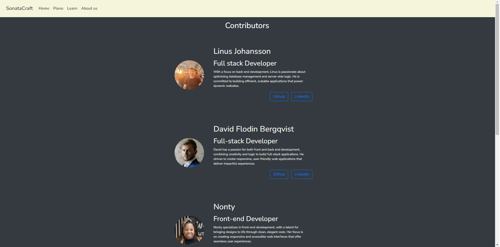

# [SonataCraft](https://team4-91bfea18c336.herokuapp.com/)

[](https://github.com/Damitwhy/Team4-Sep2024-Hackathon/commits/main)

[](https://github.com/Damitwhy/Team4-Sep2024-Hackathon/commits/main)

[](https://github.com/Damitwhy/Team4-Sep2024-Hackathon)

## Overview

SonataCraft is a site where you can re-live the glory days of the baroque era, by playing a digital piano with that classic piano sound. The user can also practice sheet music, with the included sheet staff that displays the played notes. A page with information other classical instuments is also included.

This project was created as a part of the September-24 Hackathon, hosted by Code Institute.

Team members:
- Ken (SCRUM master)
- Nonty
- Johan
- Linus
- David

## Mockup


## Wireframes

## User Stories

### Homepage
* **As a user,** I want to land on a homepage that clearly introduces the website's purpose so that I can quickly understand what it offers.
* **Achieved by:** The homepage includes a hero section with a brief introduction about the page, setting the tone for the user experience.

* **As a user,** I want to have a clear choice between "Play" and "Learn" options on the homepage so that I can easily navigate to the section that interests me.
* **Achieved by:** The "Choose Your Path" section on the homepage provides two distinct buttons: "Play" and "Learn."

### Play Option
* **As a user,** I want to be able to play a virtual piano on the "Play" page so that I can experience playing classical piano music.
* **Achieved by:** The "Play" option directs me to a piano page with an interactive piano that I can play by clicking on the keys.

### Learn Option
* **As a user,** I want to learn about classical music instruments on the "Learn" page so that I can understand what each instrument is and how it is played.
* **Achieved by:** The "Learn" option takes me to a page with flip cards displaying images of classical instruments and detailed descriptions of each, including how they are played and their roles in music.

### Navigation Bar
* **As a user,** I want to see navigation options in the navbar so that I can easily access different sections of the website.

* **Achieved by:** The navbar at the top of the page provides links to these sections. The navbar is collapsed as a burger menu on smaller screens.

## Features

### Home page

Home/landig page with welcome message. Buttons with links to play the piano, or learn about classical instruments.


### Piano page

Piano page with a playable piano, that also displays chords + music staff of the played keys. Includes instructions on how to play.



### Learn page

Learn page with cards for different classical instruments. The cards flip on hover, to display informational text.


### About us page

About us page, with a card for each contributor. Includes links to github repos and LinkedIn.




## Tools & Technologies Used

- [HTML](https://en.wikipedia.org/wiki/HTML) used for the site content.
- [CSS](https://en.wikipedia.org/wiki/CSS) used for the site design and layout.
- [JavaScript](https://www.javascript.com) used for user interaction and piano sounds.
- [Git](https://git-scm.com) used for version control.
- [GitHub](https://github.com) used for secure online code storage.
- [Python](https://www.python.org) used as the back-end programming language.
- [Heroku](https://www.heroku.com) used for hosting the deployed back-end site.
- [Bootstrap](https://getbootstrap.com) used as the front-end CSS framework for modern responsiveness and pre-built components.
- [Django](https://www.djangoproject.com) used as the Python framework for the site.
- [PostgreSQL by Code Institute](https://dbs.ci-dbs.net) used as the Postgres database from Code Institute.
- [WhiteNoise](https://whitenoise.readthedocs.io) used for serving static files with Heroku.
- [Cloudinary](https://cloudinary.com) used for online static file storage.
- [Font Awesome](https://fontawesome.com) used for the favicon.
- [ChatGPT](https://chat.openai.com) used to help debug, troubleshoot, and explain things.

## Deployment

The live deployed application can be found deployed on [Heroku](https://team4-91bfea18c336.herokuapp.com/).

### PostgreSQL Database

This project uses a [Code Institute PostgreSQL Database](https://dbs.ci-dbs.net).

To obtain my own Postgres Database from Code Institute, I followed these steps:

- Signed-in to the CI LMS using my email address.

- An email was sent to me with my new Postgres Database.

> [!CAUTION]
>  - PostgreSQL databases by Code Institute are only available to CI Students.
>  - You must acquire your own PostgreSQL database through some other method
> if you plan to clone/fork this repository.
>  - Code Institute students are allowed a maximum of 8 databases.
>  - Databases are subject to deletion after 18 months.

### WhiteNoise

This project uses [Whitenoise](https://whitenoise.readthedocs.io/en/latest/) to store static files online, due to the fact that Heroku doesn't persist this type of data.

To install whitenoise, run the `pip install whitenoise` command.

Edit your settings.py file and add WhiteNoise to the MIDDLEWARE list. The WhiteNoise middleware should be placed directly after the Django SecurityMiddleware (if you are using it) and before all other middleware:

```
MIDDLEWARE = [
    # ...
    "django.middleware.security.SecurityMiddleware",
    "whitenoise.middleware.WhiteNoiseMiddleware",
    # ...
]
```

### Cloudinary

This project uses [Cloudinary](https://cloudinary.com) for online static file storage.

To install Cloudinary, run the `pip install cloudinary` and `pip install dj3-cloudinary-storage` commands.

Edit your settings.py file and add cloudinary_storage and cloudinary to the INSTALLED_APPS list. Note that cloudinary_storage should be placed directly after the django.contrib.staticfiles.

```
INSTALLED_APPS = [
    # ...
    "django.contrib.staticfiles",
    "cloudinary_storage",
    # ...
    "cloudinary",
]
```

#### Generating a cloudinary environment variable

To sign up for cloudinary, visit [Cloudinary.com](https://cloudinary.com). 

Once you've created a Cloudinary account and logged-in, follow these series of steps to get your project connected.

- From your Cloudinary dashboard, click  "API keys".
- Generate a new API key. 
- Name it and copy your generated API environment variable.
- Your API Key and API Secret is found in your generated key. The cloud name should be automatically generated.
- Fill in your environment variable using this format:
`CLOUDINARY_URL=cloudinary://<your_api_key>:<your_api_secret>@<your_cloud_name>`

### Heroku Deployment

This project uses [Heroku](https://www.heroku.com), a platform as a service (PaaS) that enables developers to build, run, and operate applications entirely in the cloud.

Deployment steps are as follows, after account setup:

- Select **New** in the top-right corner of your Heroku Dashboard, and select **Create new app** from the dropdown menu.

- Your app name must be unique, and then choose a region closest to you (EU or USA), and finally, select **Create App**.

- From the new app **Settings**, click **Reveal Config Vars**, and set your environment variables.

> [!IMPORTANT]
> This is a sample only; you would replace the values with your own if cloning/forking my repository.
  

| Key | Value |
| --- | --- |
| `CLOUDINARY_URL` | user's own value |
| `DATABASE_URL` | user's own value |
| `DISABLE_COLLECTSTATIC` | 1 (*this is temporary, and can be removed for the final deployment*) |
| `SECRET_KEY` | user's own value |

Heroku needs three additional files in order to deploy properly.

- requirements.txt

- Procfile

- runtime.txt

You can install this project's **requirements** (where applicable) using:

-  `pip3 install -r requirements.txt`

If you have your own packages that have been installed, then the requirements file needs updated using:

-  `pip3 freeze --local > requirements.txt`

The **Procfile** can be created with the following command:

-  `echo web: gunicorn app_name.wsgi > Procfile`

-  *replace **app_name** with the name of your primary Django app name; the folder where settings.py is located*

The **runtime.txt** file needs to know which Python version you're using:

1. type: `python3 --version` in the terminal.

2. in the **runtime.txt** file, add your Python version:

-  `python-3.12.6`

For Heroku deployment, follow these steps to connect your own GitHub repository to the newly created app:

Either:

- Select **Automatic Deployment** from the Heroku app.

Or:
  
- In the Terminal/CLI, connect to Heroku using this command: `heroku login -i`

- Set the remote for Heroku: `heroku git:remote -a app_name` (replace *app_name* with your app name)

- After performing the standard Git `add`, `commit`, and `push` to GitHub, you can now type:

-  `git push heroku main`

The project should now be connected and deployed to Heroku!

### Local Deployment

This project can be cloned or forked in order to make a local copy on your own system.

For either method, you will need to install any applicable packages found within the *requirements.txt* file.

-  `pip3 install -r requirements.txt`.

  

You will need to create a new file called `env.py` at the root-level,

and include the same environment variables listed above from the Heroku deployment steps.

> [!IMPORTANT]
> This is a sample only; you would replace the values with your own if cloning/forking my repository.

Sample `env.py` file:

```python

import os
 

os.environ.setdefault("CLOUDINARY_URL", "user's own value")

os.environ.setdefault("DATABASE_URL", "user's own value")

os.environ.setdefault("SECRET_KEY", "user's own value")


# local environment only (do not include these in production/deployment!)

os.environ.setdefault("DEBUG", "True")

```
Once the project is cloned or forked, in order to run it locally, you'll need to follow these steps:

- Start the Django app: `python3 manage.py runserver`

- Stop the app once it's loaded: `CTRL+C` or `⌘+C` (Mac)

- Make any necessary migrations: `python3 manage.py makemigrations`

- Migrate the data to the database: `python3 manage.py migrate`

- Create a superuser: `python3 manage.py createsuperuser`

- Load fixtures (if applicable): `python3 manage.py loaddata file-name.json` (repeat for each file)

- Everything should be ready now, so run the Django app again: `python3 manage.py runserver`

If you'd like to backup your database models, use the following command for each model you'd like to create a fixture for:

-  `python3 manage.py dumpdata your-model > your-model.json`

-  *repeat this action for each model you wish to backup*

#### Cloning

You can clone the repository by following these steps:

1. Go to the [GitHub repository](https://github.com/Damitwhy/Team4-Sep2024-Hackathon)

2. Locate the Code button above the list of files and click it

3. Select if you prefer to clone using HTTPS, SSH, or GitHub CLI and click the copy button to copy the URL to your clipboard

4. Open Git Bash or Terminal

5. Change the current working directory to the one where you want the cloned directory

6. In your IDE Terminal, type the following command to clone my repository:

-  `git clone https://github.com/Damitwhy/Team4-Sep2024-Hackathon.git`

7. Press Enter to create your local clone.

Alternatively, if using Gitpod, you can click below to create your own workspace using this repository. 

[](https://gitpod.io/#https://github.com/Damitwhy/Team4-Sep2024-Hackathon)

Please note that in order to directly open the project in Gitpod, you need to have the browser extension installed.

A tutorial on how to do that can be found [here](https://www.gitpod.io/docs/configure/user-settings/browser-extension).

#### Forking

By forking the GitHub Repository, we make a copy of the original repository on our GitHub account to view and/or make changes without affecting the original owner's repository.

You can fork this repository by using the following steps:

1. Log in to GitHub and locate the [GitHub Repository](https://github.com/Damitwhy/Team4-Sep2024-Hackathon)

2. At the top of the Repository (not top of page) just above the "Settings" Button on the menu, locate the "Fork" Button.

3. Once clicked, you should now have a copy of the original repository in your own GitHub account!

### Local VS Deployment

There are no significant differences between local vs deployed version.

## Agile Development Process

[GitHub Projects](https://github.com/users/Damitwhy/projects/6/) served as an Agile tool for this project.

We started by coming together and creating wireframes to have an initial idea of the project. Once the ideation was complete, we divided up the tasks, and created issues for each of them. Issues were assigned, and the progess was tracked on the project board.

New issues were created and assigned as the project was progressing when new tasks arose.

## Credits

### Content
- [Tiny png](https://tinypng.com/) image compressor
- [Tone.js](https://tonejs.github.io/) web audio framework for creating interactive music in the browser.
- [Tone.js-instruments](https://github.com/nbrosowsky/tonejs-instruments) sample library used for piano sounds.
- [Tone.js-tonal](https://github.com/tonaljs/tonal) library for music theory, and functions to manipulate tonal elements.
- [Staff.js](https://github.com/instrumentbible/staff.js/) library  for music staff.
- [Vexflow](https://github.com/0xfe/vexflow) library for rendering music notation.

### Media
- [ChatGPT](https://chatgpt.com/) used for image generation.
- [Bing](https://www.bing.com/images/create?FORM=GDPGLP) used for image generation.
