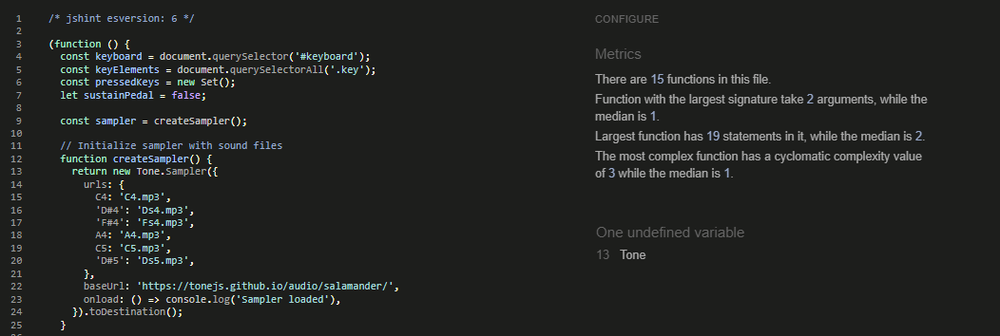
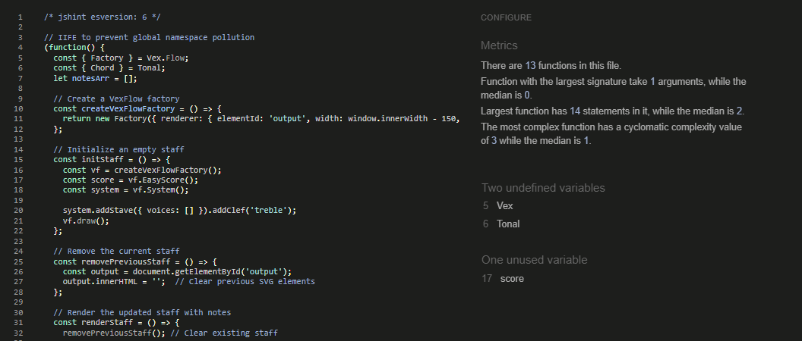
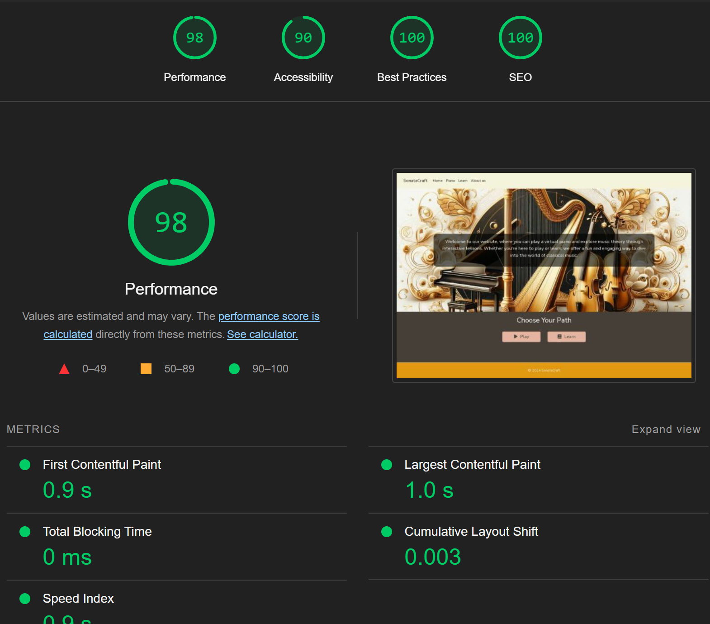
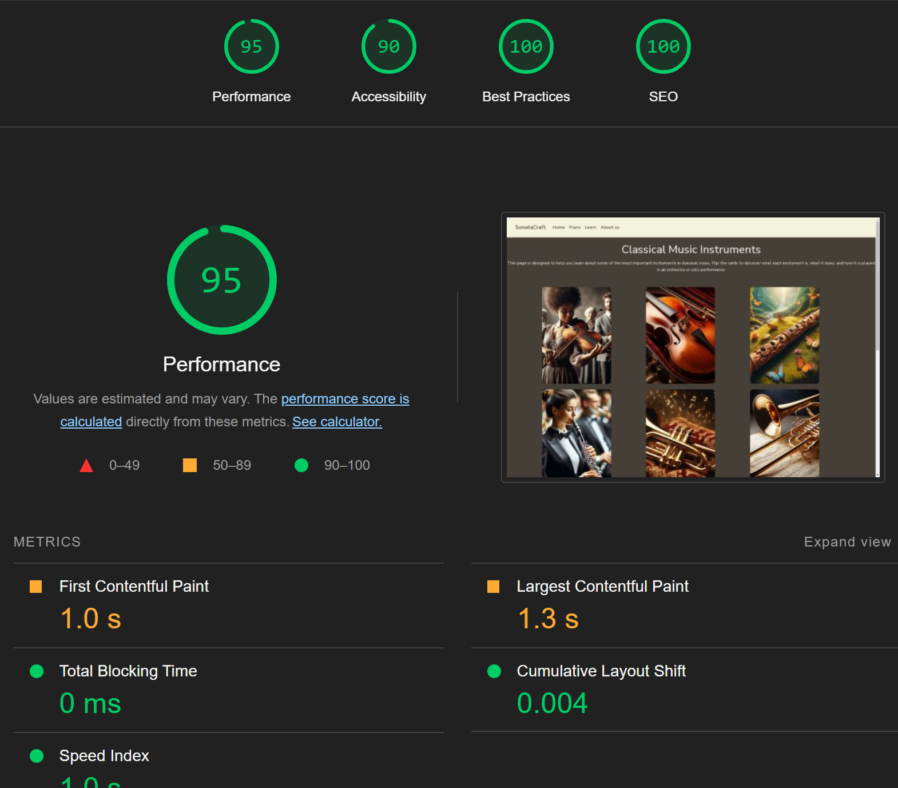
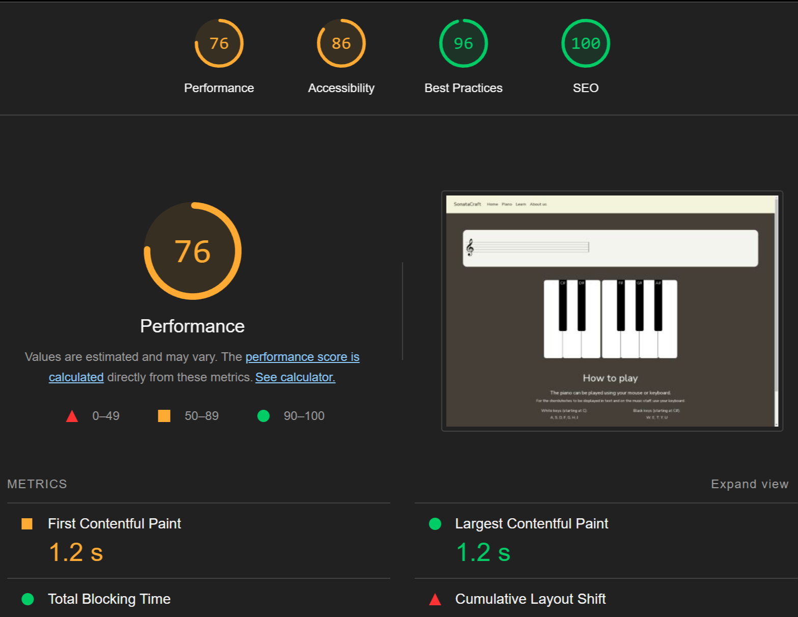
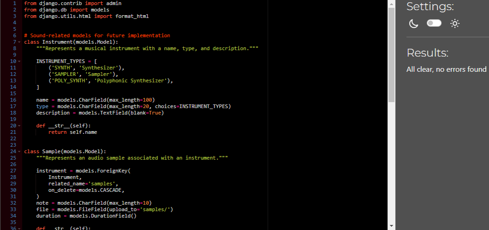
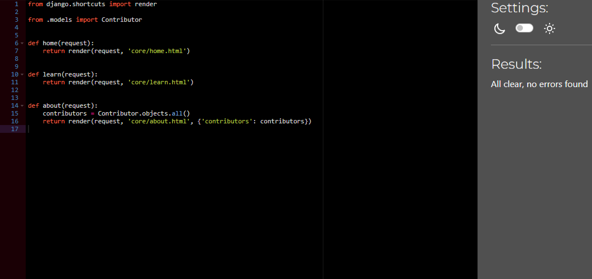
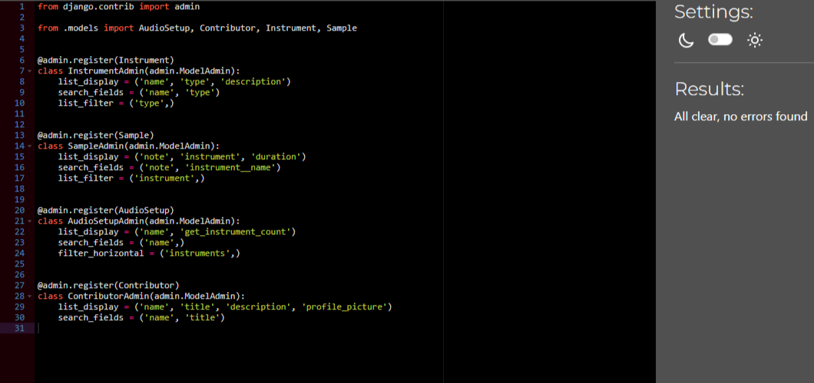

# Manual Testing Plan for Piano and Staff Rendering

This document outlines the manual testing procedures for the piano interface and staff rendering functionality. It covers key aspects such as note playing, sustain pedal usage, staff display, and UI responsiveness.

## Test Case 1: Piano Interface Loads

- **Steps**:
  - [x] Open the piano page.
  - [x] Check if all piano keys are visible.
- **Expected Result**: Piano keys should be visible.

---

## Test Case 2: Mouse Click Plays Note

- **Steps**:
  - [x] Click a white key (C).
  - [x] Click a black key (C#).
- **Expected Result**: Correct sound plays for each key.

---

## Test Case 3: Keyboard Press Plays Note

- **Steps**:
  - [x] Press 'A' for C note.
  - [x] Press 'W' for C# note.
- **Expected Result**: Sound and key highlight match pressed key.

---

## Test Case 4: Note Stops on Release

- **Steps**:
  - [x] Hold and release a key (mouse and keyboard).
- **Expected Result**: Sound stops after releasing the key.

---

## Test Case 5: Sustain Pedal (Spacebar)

- **Steps**:
  - [x] Hold space bar and press a note.
  - [x] Release the note while still holding space.
  - [x] Release space to stop sound.
- **Expected Result**: Sound sustains while space is pressed.

---

## Test Case 6: Notes Display on Staff

- **Steps**:
  - [x] Press a piano key (e.g., C).
  - [x] Check if note appears on staff.
- **Expected Result**: Correct note is displayed on staff.

---

## Test Case 7: Chords on Staff

- **Steps**:
  - [x] Press multiple keys at once (C + E).
  - [x] Check if the chord name is displayed.
- **Expected Result**: Correct notes and chord appear.

---

## Test Case 8: Responsive Design

- **Steps**:
  - [x] Open the piano on desktop and mobile.
  - [x] Resize the window and check key layout.
- **Expected Result**: Piano adjusts to screen size.

---

## JavaScript Testing

### JSHint

JSHint was used to check for errors in the JavaScript files. Below are the results:

- **piano.js** [:arrow_right:](https://github.com/Damitwhy/Team4-Sep2024-Hackathon/blob/main/static/js/piano.js)
  

- **staff.js** [:arrow_right:](https://github.com/Damitwhy/Team4-Sep2024-Hackathon/blob/main/static/js/staff.js)
  

---

## Lighthouse

Lighthouse was used to check the performance of the website. Below are the results:

- **Home page** [:arrow_right:](https://team4-91bfea18c336.herokuapp.com/)
  

- **Learn page** [:arrow_right:](https://team4-91bfea18c336.herokuapp.com/learn/)
  

- **Piano page** [:arrow_right:](https://team4-91bfea18c336.herokuapp.com/play/)
  

---

## Python Testing

CI Python Linter was used to check for errors in the Python files. Below are the results:

- **models** [:arrow_right:](https://github.com/Damitwhy/Team4-Sep2024-Hackathon/blob/main/core/models.py)
  

- **views** [:arrow_right:](https://github.com/Damitwhy/Team4-Sep2024-Hackathon/blob/main/core/views.py)
  

- **admin** [:arrow_right:](https://github.com/Damitwhy/Team4-Sep2024-Hackathon/blob/main/core/admin.py)
  

  